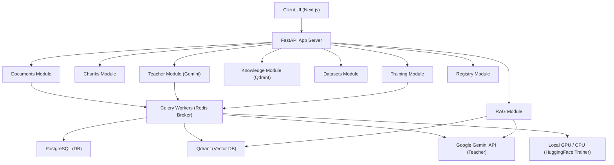

# 🌌 AI Knowledge Distillation Platform

[](https://fastapi.tiangolo.com)
[](https://nextjs.org)
[](https://www.postgresql.org)
[](https://qdrant.tech)
[](https://docs.celeryq.dev)
[](https://huggingface.co)

An end-to-end, privacy-focused pipeline platform that converts proprietary unstructured documents into structured, machine-learnable knowledge. It processes documents, builds a vector database for semantic search, generates high-quality QA training datasets via a **Teacher LLM (Google Gemini)**, and fine-tunes a compact **Student LLM (e.g., Qwen 3B)** on local compute using **QLoRA/PEFT**. Finally, it serves the models side-by-side, enabling comparative, offline RAG.


---

## 🏗️ Architecture & Pipeline Flow

The platform relies on a dual-process pipeline: **Phase 1** ingests documents, index vectors, and builds the knowledge base, while **Phase 2** extracts training data, runs LoRA fine-tuning, quantizes the model, and deploys it to the registry.



### 1. Document Processing & Ingestion (Phase 1)
```
Upload Document ──► Text Extraction ──► Semantic Chunking ──► Embedding Generation ──► Qdrant Indexing
                                                                    │
                                                                    ▼
                                                             Gemini QA Teacher
                                                                    │
                                                                    ▼
                                                            PostgreSQL Storage
```

### 2. Knowledge Distillation & Training (Phase 2)
```
Teacher QA Pairs ──► Dataset Generation (JSONL) ──► LoRA/QLoRA Fine-tuning ──► Adapter Merge ──► GGUF Quantization ──► Registry Activation
```

---

## 🗂️ Project Structure

The project is split into a **FastAPI backend** (incorporating Celery and local HuggingFace fine-tuning) and a **Next.js frontend** (with a clean, dark-themed dashboard).

```
7th sem project/
├── backend/                   # FastAPI Backend Application
│   ├── app/                   # Core application directory
│   │   ├── modules/           # Domain-driven architecture modules
│   │   │   ├── documents/     # Document ingestion, PDF/DOCX parsing, storage
│   │   │   ├── chunks/        # Semantic sliding-window text chunking
│   │   │   ├── teacher/       # QA extraction and teacher synthesis (Gemini)
│   │   │   ├── knowledge/     # Qdrant collection and vector database utilities
│   │   │   ├── rag/           # Side-by-side RAG router (Teacher vs. Student)
│   │   │   ├── datasets/      # JSONL training dataset generators
│   │   │   ├── training/      # QLoRA fine-tuning (HF PEFT/TRL) & status manager
│   │   │   └── registry/      # Model repository, download, and activation
│   │   ├── workers/           # Celery tasks (document parsing, training)
│   │   ├── utils/             # Shareable utilities (embeddings, storage, local inference)
│   │   ├── database.py        # Async SQLAlchemy and session injection
│   │   ├── main.py            # FastAPI main application and routing
│   │   └── config.py          # Pydantic Settings loaded from .env
│   ├── alembic/               # Database schemas migrations history
│   ├── storage/               # Persistence for uploads, datasets, and models
│   ├── docker-compose.yml     # Infrastructure (PostgreSQL, Redis, Qdrant)
│   ├── requirements.txt       # Python package dependencies
│   └── .env.example           # Template for environment configuration
│
├── frontend/                  # Next.js TypeScript Frontend
│   ├── src/
│   │   ├── app/               # Next.js App Router (Layouts & global styles)
│   │   ├── components/        # Dashboard interfaces (Documents, Datasets, Training, Query)
│   │   └── lib/               # Custom Axios APIs and utilities
│   ├── package.json           # Node.js package dependencies
│   └── tsconfig.json          # TypeScript configurations
│
├── Demo/                      # Directory for screenshots and documentation assets
│   └── demo.png               # Dashboard overview screenshot
│
├── start.sh                   # Startup orchestrator (runs DBs, migrations, API, workers, UI)
├── stop.sh                    # Graceful teardown script for all services
├── clean.sh                   # Interactive database cleaner and storage wiper
└── logs.sh                    # Stream aggregator and logs viewer
```

---

## 🛠️ Technology Stack

| Layer | Technologies Used |
|---|---|
| **Frontend Framework** | Next.js 16 (App Router), React 19, TypeScript |
| **Styling & UI** | Tailwind CSS 4, Radix UI, Lucide Icons, GSAP (animations) |
| **State Management** | TanStack React Query v5 |
| **Backend API** | FastAPI, Uvicorn |
| **Task Queue & Broker** | Celery, Redis 7 |
| **Databases** | PostgreSQL 16 (Relational), Qdrant (Vector Database) |
| **ORM & Migrations** | SQLAlchemy 2.0 (Async), Alembic |
| **Teacher LLM** | Google Gemini API (`gemini-2.0-flash`) |
| **Embedding Engine** | Sentence-Transformers (`sentence-transformers/all-MiniLM-L6-v2`) |
| **Student Training** | HuggingFace PEFT, TRL (LoRA/QLoRA), Transformers |

---

## ⚡ Quickstart Guide

The platform includes convenient shell scripts in the root directory to orchestrate the entire developer environment.

### 1. Prerequisites
Ensure you have the following installed on your machine:
- Docker and Docker Compose
- Python 3.10+ (with `venv` support)
- Node.js 18+ and `npm`

### 2. Configure Environment Variables
Copy the `.env.example` in the backend directory to `.env` and fill in your details:
```bash
cp backend/.env.example backend/.env
```
Make sure to add your **Google Gemini API Key**:
```env
GEMINI_API_KEY=your_gemini_api_key_here
```

### 3. Start the Stack
Run the `start.sh` orchestrator script at the root:
```bash
chmod +x start.sh stop.sh clean.sh logs.sh
./start.sh
```
This script will:
1. Spin up PostgreSQL, Redis, and Qdrant containers in Docker.
2. Wait for these services to be healthy.
3. Set up the Python `.venv` and install backend packages.
4. Run DB migrations using Alembic.
5. Start the FastAPI server (port `8000`) and Celery worker.
6. Build and launch the Next.js development server (port `5173`).

Once successfully started, open:
* **Frontend App**: [http://localhost:5173](http://localhost:5173)
* **Interactive API Docs**: [http://localhost:8000/docs](http://localhost:8000/docs)
* **Qdrant Vector Dashboard**: [http://localhost:6333/dashboard](http://localhost:6333/dashboard)

---

## 🎛️ Development & Operational Scripts

### Unified Log Streaming
Aggregate and stream logs from all running processes (Uvicorn backend, Celery task worker, and Next.js frontend) with a single menu command:
```bash
./logs.sh
```
*Options:*
1. Stream Backend API (Uvicorn) logs
2. Stream Celery Worker logs
3. Stream Frontend (Next.js) logs
4. Stream Docker Compose logs
5. Stream all logs together in one terminal

### Graceful Teardown
To gracefully stop all backend processes, Celery workers, Next.js servers, and spin down the Docker containers, run:
```bash
./stop.sh
```

### Data Cleanup and Reset
Use the interactive cleanup script to selective wipe databases, collections, and file stores:
```bash
./clean.sh
```
*Options:*
- **Full reset:** Wipes all database tables, vector collections, cached Celery queues, model adapters, and raw uploaded document files.
- **Documents & Datasets reset:** Cleans up knowledge bases and generated training sets without deleting trained models.
- **Datasets only / Models only:** Targeted DB table and storage path wiping.
- **Custom reset:** Checkboxes to select exactly what elements to clean.

---

## 📖 Comparative RAG (Teacher vs. Student)

The core validation feature of the platform is **Side-by-Side RAG Querying**. Once a Student Model has been trained via QLoRA, merged, quantized to GGUF, and set to `active` inside the Model Registry, querying the endpoint:

`POST /api/v1/rag/query`

with the payload:
```json
{
  "query": "What are the rules for safety goggles in the lab?",
  "top_k": 3,
  "query_student": true
}
```

returns a dual response comparing the high-end Gemini teacher model answer with the fine-tuned, localized student model running on local resources:

```json
{
  "answer": "Safety goggles must be worn at all times while in the laboratory area, specifically when handling chemicals or heating materials. (Teacher/Gemini)",
  "student_answer": "According to Section 4.2, students must wear approved safety goggles when using laboratory equipment and chemicals. (Active Student Model)",
  "student_version": "v1_Qwen3B_FineTuned",
  "sources": [
    {
      "document_title": "Lab_Safety_Guidelines.pdf",
      "snippet": "Section 4.2: Eye Protection. Safety goggles must be worn at all times by everyone in the room...",
      "score": 0.892
    }
  ]
}
```
This enables real-time validation of how closely your quantized student model matches the knowledge retrieval capabilities of the larger teacher model!
