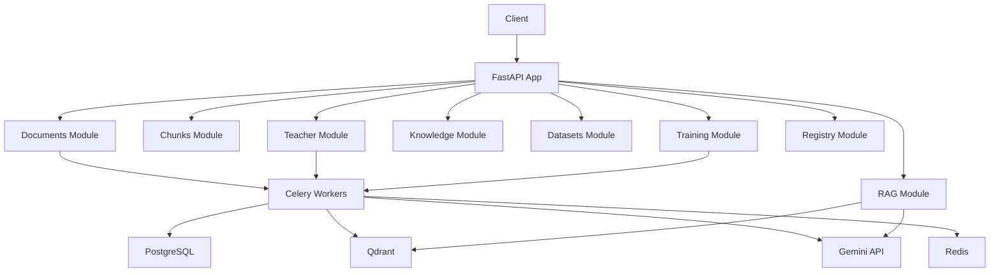

# AI Knowledge Distillation Platform — Walkthrough

## Summary

Built a complete backend API for an AI Knowledge Distillation Platform covering **Phase 1 (document processing + RAG)** and **Phase 2 (student model training + deployment)**. The system consists of **65 files** across **8 domain modules**.

---

## Architecture



---

## Technology Stack

| Layer | Technology |
|-------|-----------|
| Framework | FastAPI + Uvicorn |
| Database | PostgreSQL 16 (async via asyncpg) |
| Vector DB | Qdrant |
| Cache/Broker | Redis 7 |
| Task Queue | Celery |
| Teacher LLM | Google Gemini API (`gemini-2.5-flash`) |
| Embeddings | `sentence-transformers/all-MiniLM-L6-v2` (384-dim) |
| Training | HuggingFace PEFT + TRL (LoRA/QLoRA) |
| ORM | SQLAlchemy 2.0 (async) |
| Migrations | Alembic (async) |

---

## Files Created (65 total)

### Infrastructure (5 files)
| File | Purpose |
|------|---------|
| [docker-compose.yml](file:///home/kainin/Desktop/Projects/7th%20sem%20project/backend/docker-compose.yml) | PostgreSQL, Redis, Qdrant containers |
| [requirements.txt](file:///home/kainin/Desktop/Projects/7th%20sem%20project/backend/requirements.txt) | Pinned Python dependencies |
| [.env.example](file:///home/kainin/Desktop/Projects/7th%20sem%20project/backend/.env.example) | Environment variable template |
| [.env](file:///home/kainin/Desktop/Projects/7th%20sem%20project/backend/.env) | Active environment config |
| [.gitignore](file:///home/kainin/Desktop/Projects/7th%20sem%20project/backend/.gitignore) | Git ignore rules |

### Core Application (8 files)
| File | Purpose |
|------|---------|
| [main.py](file:///home/kainin/Desktop/Projects/7th%20sem project/backend/app/main.py) | FastAPI app entry, lifespan, all routers |
| [config.py](file:///home/kainin/Desktop/Projects/7th%20sem project/backend/app/config.py) | Pydantic Settings from .env |
| [database.py](file:///home/kainin/Desktop/Projects/7th%20sem project/backend/app/database.py) | Async SQLAlchemy engine + session |
| [dependencies.py](file:///home/kainin/Desktop/Projects/7th%20sem project/backend/app/dependencies.py) | FastAPI dependency injection |
| [exceptions.py](file:///home/kainin/Desktop/Projects/7th%20sem project/backend/app/utils/exceptions.py) | Custom HTTP exceptions |
| [file_storage.py](file:///home/kainin/Desktop/Projects/7th%20sem project/backend/app/utils/file_storage.py) | Async file upload/download |
| [embeddings.py](file:///home/kainin/Desktop/Projects/7th%20sem project/backend/app/utils/embeddings.py) | Sentence-transformers wrapper |
| [student_inference.py](file:///home/kainin/Desktop/Projects/7th%20sem project/backend/app/utils/student_inference.py) | Active student model inference loader & generation |

### Domain Modules (8 modules, 40 files)

Each module follows the pattern: `models.py` → `schemas.py` → `service.py` → `router.py` + specialized files.

---

## API Endpoints (27 total)

### Phase 1: Document Processing & RAG

| Method | Endpoint | Description |
|--------|----------|-------------|
| POST | `/api/v1/documents/upload` | Upload a document |
| GET | `/api/v1/documents/` | List documents |
| GET | `/api/v1/documents/{id}` | Get document details |
| POST | `/api/v1/documents/{id}/process` | Trigger processing pipeline |
| DELETE | `/api/v1/documents/{id}` | Delete document |
| GET | `/api/v1/chunks/document/{id}` | List chunks for a document |
| GET | `/api/v1/chunks/{id}` | Get a specific chunk |
| GET | `/api/v1/teacher/outputs/document/{id}` | List teacher outputs |
| GET | `/api/v1/teacher/outputs/chunk/{id}` | Get teacher output for chunk |
| POST | `/api/v1/teacher/process` | Trigger teacher processing |
| GET | `/api/v1/teacher/stats` | Teacher usage statistics |
| GET | `/api/v1/knowledge/info` | Knowledge base stats |
| POST | `/api/v1/knowledge/initialize` | Initialize Qdrant collection |
| **POST** | **`/api/v1/rag/query`** | **RAG Q&A with citations** |
| POST | `/api/v1/rag/search` | Semantic search only |

### Phase 2: Training & Model Registry

| Method | Endpoint | Description |
|--------|----------|-------------|
| POST | `/api/v1/datasets/generate` | Generate training dataset |
| GET | `/api/v1/datasets/` | List datasets |
| GET | `/api/v1/datasets/{id}` | Get dataset details |
| GET | `/api/v1/datasets/{id}/samples` | Preview samples |
| GET | `/api/v1/datasets/{id}/download` | Download JSONL |
| POST | `/api/v1/training/start` | Start LoRA training |
| GET | `/api/v1/training/` | List training runs |
| GET | `/api/v1/training/{id}` | Get run status/metrics |
| POST | `/api/v1/training/{id}/cancel` | Cancel training |
| GET | `/api/v1/models/` | List model versions |
| GET | `/api/v1/models/active` | Get active model |
| GET | `/api/v1/models/{id}` | Get model details |
| POST | `/api/v1/models/{id}/activate` | Set active model |
| GET | `/api/v1/models/{id}/download` | Download model |
| GET | `/api/v1/models/{id}/metrics` | Get model metrics |

---

## Comparative RAG Feature

You can now query both the **Teacher (Gemini)** and the active **Student (Fine-tuned local model)** side-by-side in a single call to the backend.

### RAG Query Endpoint
`POST /api/v1/rag/query`

**Request Payload:**
```json
{
  "query": "What is the refund period?",
  "top_k": 3,
  "query_student": true
}
```

**Response Payload:**
```json
{
  "answer": "The refund period is 30 days. (Teacher/Gemini response)",
  "student_answer": "According to the context, you can return products within 30 days. (Fine-tuned student response)",
  "student_version": "v1",
  "sources": [ ... ]
}
```

---

## Data Flow

### Document Processing Pipeline
```
Upload → Parse (PyMuPDF/python-docx) → Chunk (semantic) → Embed (MiniLM) → Qdrant → Gemini Teacher → PostgreSQL
```

### RAG Query
```
               ┌─── [Embedding & Vector Search] ───┐
               │                                   │
               ▼                                   ▼
       [Gemini (Teacher)]             [Fine-tuned Student (Local)]
               │                                   │
               └─────────► [Merged JSON Response] ◄─┘
```

### Training Pipeline
```
Teacher Outputs → Dataset Generation (JSONL) → QLoRA Training → Adapter Merge → GGUF Quantization → Registry
```

---

## How to Get Started

```bash
# 1. Start infrastructure
cd backend
docker-compose up -d

# 2. Install dependencies
pip install -r requirements.txt

# 3. Set your Gemini API key in .env
# GEMINI_API_KEY=your-key-here

# 4. Start the API server
uvicorn app.main:app --reload

# 5. Start Celery worker (in another terminal)
celery -A app.workers.celery_app worker --loglevel=info -Q default,documents,teacher

# 6. Open API docs
# http://localhost:8000/docs
```

---

## What Was Not Built
- Frontend UI (skipped per user preference)
- Dockerfile for the app itself (infrastructure containers only)
- Authentication/RBAC (left as API-key placeholder for MVP)
- Automated tests (structure defined but not implemented)
